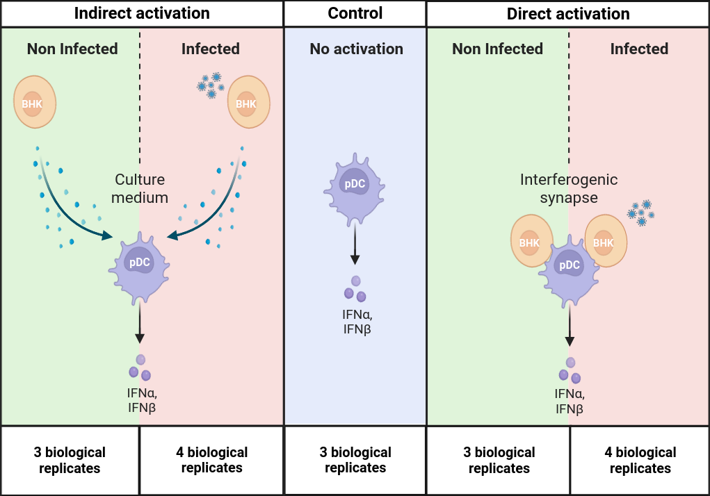
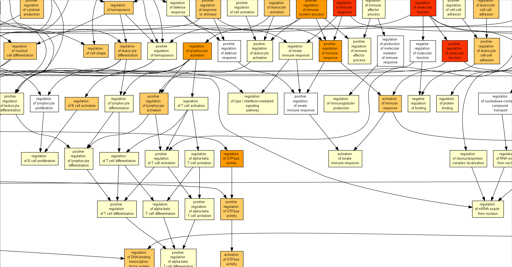
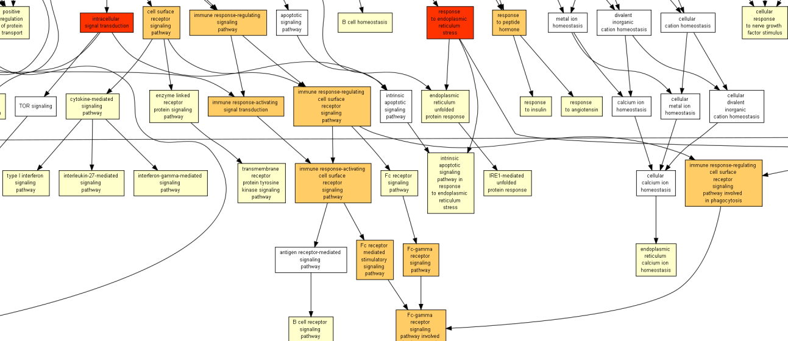
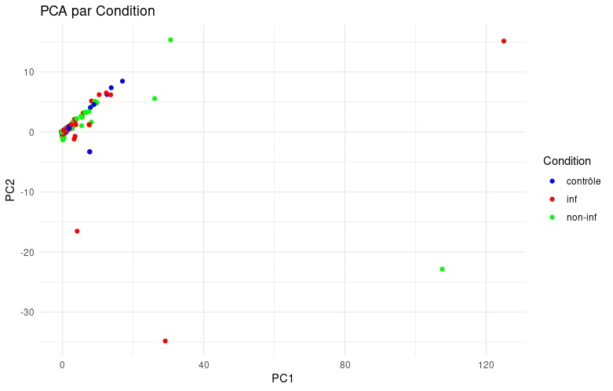
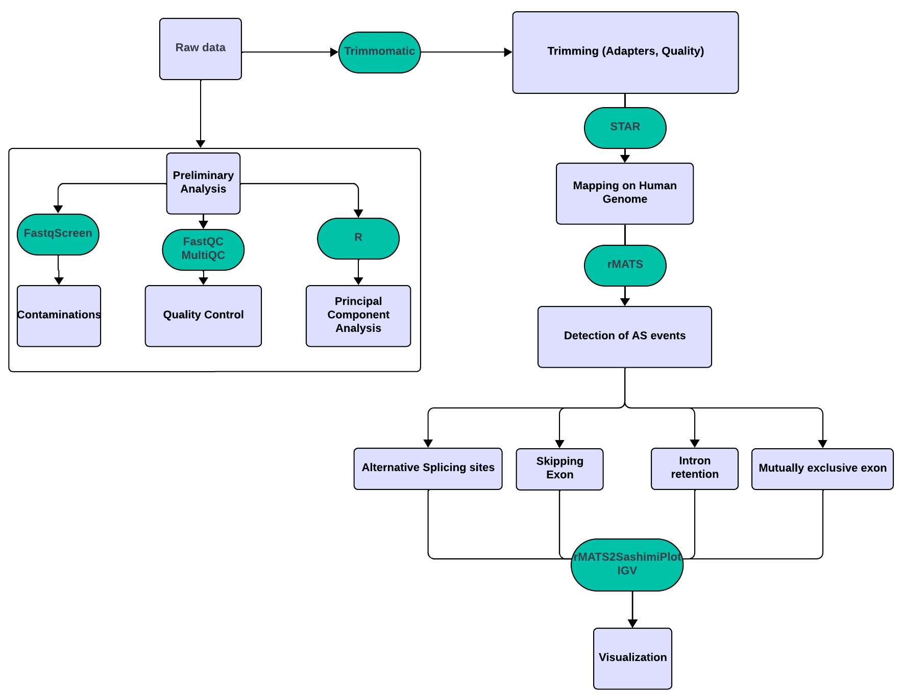
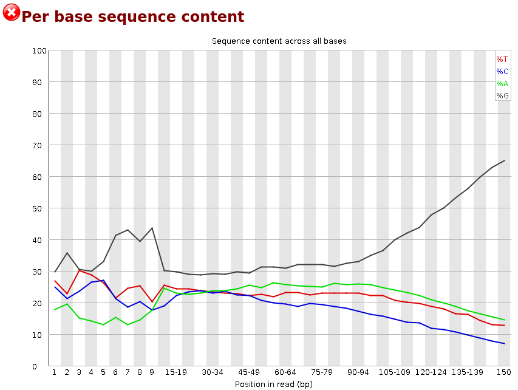
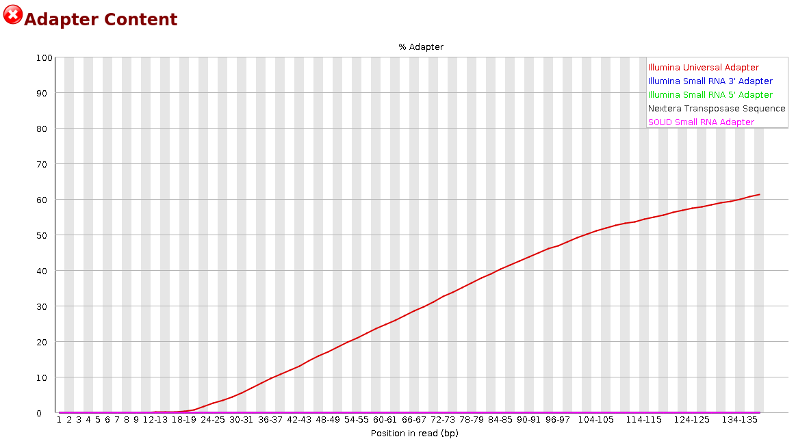
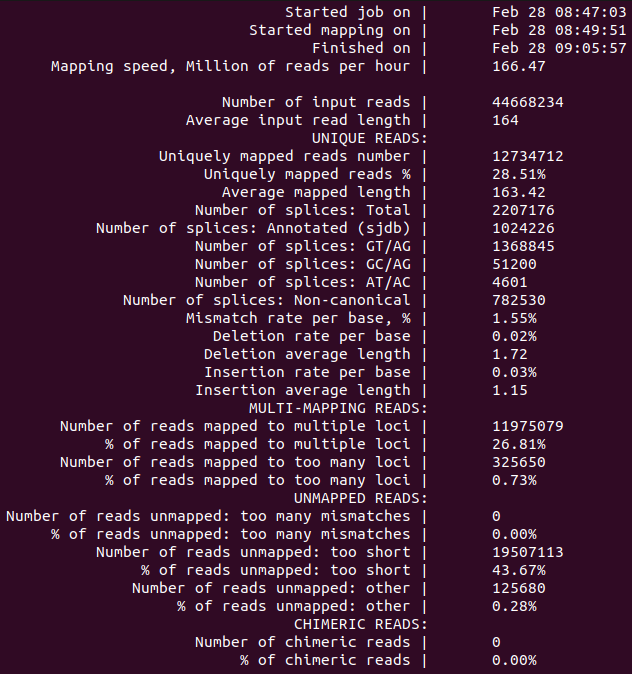

# Bio-informatic Project_2

## Table of contents

- [Introduction](#introduction)
  - [Context](#context) 
  - [Dataset description](#dataset-description) 
  - [Aims of this project](#aims-of-this-project) 
- [Preliminary Analysis](#preliminary-analysis)
  - [GO Diagram](#go-diagram)
  - [Principal Component Analysis (PCA)](#principal-component-analysis-pca)
    - [PCA on transcript counts](#pca-on-transcript-counts)
    - [PCA on expressed gene counts](#pca-on-expressed-gene-counts) 
- [Workflow and pipeline](#workflow-and-pipeline)
  - [Control quality and trimming](#1-control-quality-and-trimming)
    - [FastQC](#11-fastqc)
    - [MultiQC](#12-multiqc)
    - [Trimmomatic](#13-trimmomatic)
  - [Mapping](#2-mapping)
  - [Detection of alternative splicing events](#3-detection-of-alternative-splicing-events)
  - [Results representation](#4-results-representation)
 
- [Challenges](#challenges)
  - [Reads Quality](#reads-quality)
  - [Alignment](#alignment)
  - [BHK Contaminant](#bhk-contaminant)

- [Conclusion](#conclusion)
- [Contributors and Contacts](#contributors-and-contacts)
- [Ressources](#ressources)


***

## Introduction

### Context

Since last decades, cities expansion and human activities have led humans to interact with more and more species that we haven't face yet. This interaction with different species show us that zoonoses (like virus with CoVID19) can appear. So, understanding immune system mechanisms, espacially in the context of virus infection have became a public health issue. In human species, virus infection are mostly managed by immune cells called plasmacytoïd dendritic cells (pDC). Thoses cells are huge producers of type 1 interferon, a very efficient alarming cytokine that put cells in a virus aware state, ready to resist to virus infection [[1]](https://www.ncbi.nlm.nih.gov/pmc/articles/PMC10298684/). Several other proteins are synthetised by pDC, and this will allow a very specific immune response against the virus. Thus, in context of virus infection, these proteins produced by pDC are essential and so, really regulated. Among these regulatory mechanisms, alternative splicing remodelling could explain how pDC can adapt their response according to the virus they face. Such mechanisms have already been showned in others immune cells [[2]](https://pubmed.ncbi.nlm.nih.gov/34905508/) [[3]](https://www.ncbi.nlm.nih.gov/pmc/articles/PMC7230527/) [[4]](https://www.ncbi.nlm.nih.gov/pmc/articles/PMC7912025/), but actually, mechanisms in pDC aren't still well known.

### Dataset description

In order to see if pDC present alternative splicing remodelling in context of virus infection, we have in our possession, a full dataset of RNA sequencing of pDC, according different conditions of stimulation. We use here Baby Hamster Kidney (BHK) cells infected with Dengue virus. Here, BHK cells are necessary to activate pDC as pDC can't be directly infected by virus (due to his high proportion of type 1 interferon produced). One set of samples are RNA from pDC activated by direct interaction with infected BHK cells via the formation of an interferogenic synapse [[5]](https://pubmed.ncbi.nlm.nih.gov/31003939/). The other set of sample are RNA from pDC activated by indirect interaction with the culture medium of infected BHK cells. For each set of sample we dispose of a non-infected condition (pDC interaction (direct or indirect) with a non-infected BHK cells) and a control condition (none interactions (either direct or indirect) between pDC and BHK cells). Moreover, non-infected condition is not the same as control condition because with this 2 separeted conditions this will allow us to discard any effect of pDC-BHK intection itself (regardless of the infection state of BHK cells) on the alternative splicing, who could bias our analysis. Finally, for every conditions, we have several biological replicates. Some of them are from a 2020 experiment but the major part of sample are from a 2023 experiment.

Here is a summary scheme



### Aims of this project

Problematics for the project are first :

1. Does quality and depth of dataset provide are sufficient to detect any signal of differential alternative splicing between conditions ?

And if so :

2. Is there alternative splicing remodelling between conditions ? And which genes are concerned ?


To respond to theses question asked by project leaders, we have set up a complete RNAseq analysis pipeline. But before that we have performed advanced preliminary analysis.


***


## Preliminary Analysis

### GO Diagram

According to the [Gene Ontology Consortium](https://geneontology.org/) “The Gene Ontology (GO) describes our knowledge of the biological domain with respect to three aspects: Molecular Function, Cellular Component, Biological Process”. GO applied to our data could be an excellent method to see if the sequencing and genes expressed in our dataset assess well the biology of pDC cells. To achieve this, for one of the replicate files, we have taken gene counts output by STAR, sort genes by their abundance and we have compiled in a list the first 50.000 most expressed gene ID. After that, we have used [GOrilla](https://cbl-gorilla.cs.technion.ac.il/), a web application capable of translating genes ID into GO terms and identified enriched GO terms in this list. GOrilla outputs a graph that sums up the biology process, molecular functions and cellular component, captured by the sequencing. To run GOrilla we have indicated that the organism species is “Homo Sapiens”, the gene ID list is a “Single ranked list of genes”, that we wanted to see “All” ontology with P-value not higher than 10⁻³.

Here is the full GO diagram :


Here are some zoom of GO diagram :




We can see that most parts of the diagram represent immune process. As a matter of fact, we can found some Gene Ontology corresponding to "regulation of type 1 interferon production", "activation of innate immune response", "cytokine-mediated signaling pathway", "immune response-regulating cell surface receptor signaling pathway"
These terms tend to refer to functions found in pDC (type 1 interferon signaling and cytokine signaling)

This GO diagram comforts us with the idea that reads sequenced seems to be representative and reflect well the biology of pDC. We don't see here a bias in our dataset.  

### Principal Component Analysis (PCA)

#### PCA on transcript counts

In order to look at any signals in our dataset, we have performed a Principal Component Analysis (PCA) on the count of each transcription in the different conditions. To do that, we have begun by doing a pseudo-alignment with [Kallisto](https://pachterlab.github.io/kallisto/) for each condition with the quant mode activated in order to collect all transcripts counts. Pseudo-alignement was performed on the human transcriptome from Ensembl
After that, with R, we gathered all abundance.tsv files and preserved only “traget_id” and “tpm” columns. Only transcripts with a TPM > 0.5 were preserved to filtered out too low expressed transcripts. This treshold is totally arbitrary, there is no perfect threshold, but with some research in the bioinformatic community and forum, we have concluded that  is not to high but sufficient to remove low transcripts expression. We then merge all abundance file for each replicate by their identical target_id and NA values were replaced by 0. Finally, we use the R function “prcomp” in R, to perform the PCA on transcript.

The PCA can be seen here : 



Interprétation : 

As we can see in the figure, all points are clustered together. It is impossible to distinguish and separate the different conditions from each other. This could be interpreted as a lack of signal in our data between conditions. However, we must take these results with a pinch of salt. Indeed, maybe somehow, our PCA on transcripts is not well executed or something that we didn’t understand could lead to these specific results. It is difficult to have a clear conclusion and further analysis need to be done to say that there is no signal in our dataset, yet this can be a first clue for a sequencing depth too low to see differences between conditions. 

#### PCA on expressed gene counts

***
## Pipeline and results

After, these preliminary analyses we conducted the full pipeline. First, we performed trimming of adapters and poor-quality reads using the Trimmomatic tool. These cleaned reads were then mapped against the human genome via a splice-aware mapper, STAR. Afterwards, these mapped reads were given to rMATS, a software for detecting alternative splicing events. rMATS outputs different types of events, and we have visualized all of this with various tools such as IGV and rmats2sashimiplot.



### 1. Control quality and trimming

#### 1.1. FastQC

In order to look at the quality of sequencing file before any further investigation, we’ve controlled reads quality for each file.

- ***Command line:***

```
fastqc --noextract input_file_R1.fastq.gz input_file_R2.fastq.gz
```
- ***Arguments:***
  - `--noextract` : Keep input file in .gz format to ease data manipulation during the pipeline


#### 1.2. MultiQC

After inspecting each file with fastqc, we have resumed fastqc analysis with a multiqc to have a global view of the dataset provided. We gathered .fastqc reports in one directory: 

- ***Command line:***
```
multiqc .
```
##### Interpretation

By looking at raw data with the FastQC tool, we have seen really interesting features. Indeed, reads before trimming seems to have a disproportionate amount of guanine at the 3' end of reads, like represent in this picture : 



In the same way, we have found, in several _R2.fastq (reversed reads complementary to forward reads), overexpressed sequences that seem to correspond to poly guanine expression. Here an example : 


With some researches, we have found that these overexpressed sequences are often found in sequencing data from Illumina sequencers NovaSeq/NextSeq. According to some users on [this](https://www.biostars.org/p/9499939/) BioStar forums "Poly-G reads represent cluster producing no signal in two-color chemistry" like we found in these sequencers. These informations are confirmed too on [this](https://www.researchgate.net/post/What_can_cause_poly-G_tails_on_NextSeq_fastq_from_seemingly_failed_libraries) ResearchGate forum. We think that may be the reasons of what we can see with G content in 3' end and with overexpressed sequences in our data.
On the over side, the overrepresented sequences of "N" can indicate quality issues at certain locations within the sequences. These 2 files commes from a previous experiment realize in 2020.
As these overexpressed sequences are not highly expressed in our dataset (only around ~0.20% of total sequences), this will not bias our analysis, and with a trimming step, these sequences will be removed. But it seems important to us to understand from what this can arise from, can this have an impact on our analysis, and inform project leader that this could probably happen in their next analysis.

Moreover, on all of the .fastq files, as we can see on the picture bellow, there is a high amount of adapters even in the middle of reads. 



As prensented in the next section, this has cause problems during the trimming steps and after for the alignement with STAR, because reads have been severly truncated with trimming steps, and this lead to a lots of very short reads.


#### 1.3. Trimmomatic

As shown with fastqc/multiqc reports, a high proportion of adapters is present in reads. We need to trim these adapters. To do these steps we have chosen Trimmomatic tools. Command line can contains a lot of options allowing to highly personalized command line.

- ***Command line:***
```
trimmomatic PE -threads 30 input_R1.fastq.gz input_R2_.fastq.gz output_R1_TrimmedPaired.fastq.gz output_R1_TrimmedUnpaired.fastq.gz output_R2_TrimmedPaired.fastq.gz output_R2_TrimmedUnpaired.fastq.gz ILLUMINACLIP:directory/to/adapters/TruSeq3-PE.fa:2:30:10:11:true
```


- ***Arguments:***
  - `PE`: Indicate to Trimmomatic to treat input file as Paired End (PE) data.
  - `output`: 4 different file names must be provided to store trimmed reads according to input files (R1 or R2) and according to their processing by trimmomatic. For one input paired read, Trimmomatic can keep after trimming, the both reads (TrimmedPaired) or only one reads, orphan reads, because the quality of his mate is very too low (TrimmedUnpaired).
  - `ILLUMINACLIP`: Specified step to remove Illumina adapters.
    - `TruSeq3-PE.fa`: fasta file containing adapters sequences to remove.
    - `seed mismatches = 2`: Maximum mismatches allowed for adapters.
    - `palindrome clip threshold = 30`: Minimum matches allowed between both reads of one pair for adapters clipping.
    - `simple clip threshold = 10`: Minimum matches allowed in one read for adapters clipping.
    - `minAdapterLength = 11`: Minimum length of adapters for clipping.
    - `KeepBothRead = True`: Avoid orphans reads and keep reads pair even if one of them is bad quality or too short. Bad reads will be removed anyway by mapping in further steps. Most mapping tools can’t handle unpaired reads. With this option, next step will be facilitated.


After this trimming step, we performed another fastqc/multiqc analysis to verify that all adapters have been removed and quality of reads are enough to perform mapping.


### 2. Mapping

To map reads, we have used STAR. This is a splice-aware mapping tool. It can map RNAseq derived reads to a reference genome and consider reads matching on exons between introns.

- ***Command line:***

```
STAR --runThreadN 8 --genomeDir hg38_StarIndex --sjdbGTFfile hg38_annotations.gtf --readFilesCommand gunzip -c --readFilesIn input_R1_TrimmedPaired.fastq.gz input_R2_TrimmedPaired.fastq.gz --outSAMtype BAM SortedByCoordinate --quantMode GeneCounts --outFileNamePrefix [label]
```


- ***Arguments:***
  - `--genomeDir`: Path to the genome index created with STAR. We work here with the hg38 Homo Sapiens genome.
  - `-sjdbGTFfile`: Path to the annotation file (GTF). As the genome is hg38 version, we have provided here the GTF file associated to the hg38 genome.
  - `--readFilesCommand gunzip -c`: This allows STAR to read fastq.gz files without uncompressing the file, and eases their manipulation.
  - `--outSAMtype BAM SortedByCoordinate`: STAR output will be in .bam format and alignments ordered by their coordinates.
  - `--quantMode GeneCounts`: Option specified to STAR to output an additional file where counts are saved for each gene presenting a read alignment.
  - `--outFileNamePrefix [label]`: Add a label for the file to have consistent naming.


### 3. Detection of alternative splicing events

To analyze splicing events, we use a popular tool: rMATS. This tool will use reads aligned by STAR and search for differences in different types of alternative splicing events between 2 conditions (skipping exon, alternative 3’ and 5’ alternative splicing sites, mutually exclusive exons, and intron retention).

- ***Command line:***

```
 rmats.py --b1 bam1.txt --b2 bam2.txt --gtf hg38_annotations.gtf -t paired --nthread 25 --od . --tmp tmp/ --variable-read-length --readLength 100
```

- ***Arguments:***
  - `--b1 / --b2`: These are .txt files containing paths to .bam files. Replicates were separated by a “,”.
  - `--gtf`: Path to the .gtf annotation file used during the mapping step with STAR.
  - `-t paired`: Specify to rMATS that data are paired-end.
  - `--readLength 100`: Indication to rMATS to estimate reads length for the calculation of inclusion of junction reads and other parameters.
  - `--variable-read-length`: Allow reads to have a length that differs from the --readLength option. This is the case here because trimming output different length for our reads.


### 4. Results representation

rmats2sashimiplot is an extension of rMATS that uses rMATS outputs and represents splicing events with a Sashimi plot.

- ***Command line:***

```
rmats2sashimiplot -o output_directory --l1 7010 --l2 7014 --event-type SE -e SE.MATS.JCEC.txt --b1 bam1.sortedByCoord.out.bam --b2 bam2.sortedByCoord.out.bam
```

- ***Arguments:***
  - `--l1 / --l2`: Add a label to results samples.
  - `--event-type SE`: Specify the type of event to represent. SE means “Skipping Event.”
  - `-e`: Path to the rMATS output file associated with the type of event.
  - `--b1 / --b2`: Path to .bam files output by STAR.

***

## Challenges

### Alignment 

As a result of very short reads generated by the trimming step, numerous reads have not been mapped to the human genome. A very high percentage was “unmapped because too short” according to STAR. 



This is a problem because it could compromise further investigation and reduce the depth of the sequencing because we have lost a lot of information during trimming step. This is even more problematic when we know that to detect rare events like alternative splicing events the sequencing depth must be much higher than classical differential gene expression. 


### BHK Contaminant

Finally, in the condition, pDC+BHK, we want to see if pDC in direct contact with BHK (infected or non infected cells) could lead to different alternatives splicing events. BHK are cells that come from hamster species (nom de l'espèce). However, in order to perform analysis, we need first to remove some of BHK contaminants transferred to pDC during the contact. Indeed, during the interferogenic synapse, some RNA of BHK could be transferred to the pDC and contaminate the RNA of pDC. A solution to discard these RNA is to mapped these mixed RNA (pDC and BKH) on the hamster genome to remove all reads that mapped on this genome and so, corresponding to contaminants RNA. Then we use the dataset pDC+BKH separated from BHK originated reads, and pursue the pipeline established. This is necessary if we don’t want to be biased and wrongly allocate expression of genes from BHK to pDC. THis could interfere with conclusions. 

***

## Conclusion

***

## Contributors and Contacts

### **Project contributors**

For more informations, please contact :  
- Ariane Paradan (ariane.paradan@etu.univ-lyon1.fr)  
- Rayann Larbi (rayann.larbi@etu.univ-lyon1.fr)  
- Jordan Dutel (jordan.dutel@etu.univ-lyon1.fr)  

Master Bioinfo@Lyon


### **Project leaders**

Delphine Galiana, Team VIV, CIRI (delphine.galiana@ens-lyon.fr)  
Camille Daligault, Team VIV, CIRI (camille.daligault@ens-lyon.fr)

### **Project tutor**

Vincent Lacroix, Team Baobab, LBBE (vincent.lacroix@univ-lyon1.fr)

***

## Ressources

- [FastQC](https://www.bioinformatics.babraham.ac.uk/projects/fastqc/ "FastQC site")
- [MultiQC](https://multiqc.info/ "MultiQC site")
- [STAR](https://github.com/alexdobin/STAR "STAR GitHub")
- [rMATS](https://github.com/Xinglab/rmats-turbo "rMATS-turbo GitHub")
- [rMATS2sashimiplot](https://github.com/Xinglab/rmats2sashimiplot "rMATS2sashimiplot GitHub")

## References

- [[1]](https://www.ncbi.nlm.nih.gov/pmc/articles/PMC10298684/) Mertowska, Paulina et al. “Immunomodulatory Role of Interferons in Viral and Bacterial Infections.” International journal of molecular sciences vol. 24,12 10115. 14 Jun. 2023, doi:10.3390/ijms241210115
- [[2]](https://pubmed.ncbi.nlm.nih.gov/34905508/) Li, Xiaobo et al. “An alternatively spliced STING isoform localizes in the cytoplasmic membrane and directly senses extracellular cGAMP.” The Journal of clinical investigation vol. 132,3 (2022): e144339. doi:10.1172/JCI144339
- [[3]](https://www.ncbi.nlm.nih.gov/pmc/articles/PMC7230527/) Hurtado-Guerrero, Isaac et al. “Antiviral, Immunomodulatory and Antiproliferative Activities of Recombinant Soluble IFNAR2 without IFN-ß Mediation.” Journal of clinical medicine vol. 9,4 959. 31 Mar. 2020, doi:10.3390/jcm9040959
- [[4]](https://www.ncbi.nlm.nih.gov/pmc/articles/PMC7912025/) Xu, Xiaofang et al. “Alternative mRNA Processing of Innate Response Pathways in Respiratory Syncytial Virus (RSV) Infection.” Viruses vol. 13,2 218. 31 Jan. 2021, doi:10.3390/v13020218
- [[5]](https://pubmed.ncbi.nlm.nih.gov/31003939/) Assil, Sonia et al. “Plasmacytoid Dendritic Cells and Infected Cells Form an Interferogenic Synapse Required for Antiviral Responses.” Cell host & microbe vol. 25,5 (2019): 730-745.e6. doi:10.1016/j.chom.2019.03.005 


